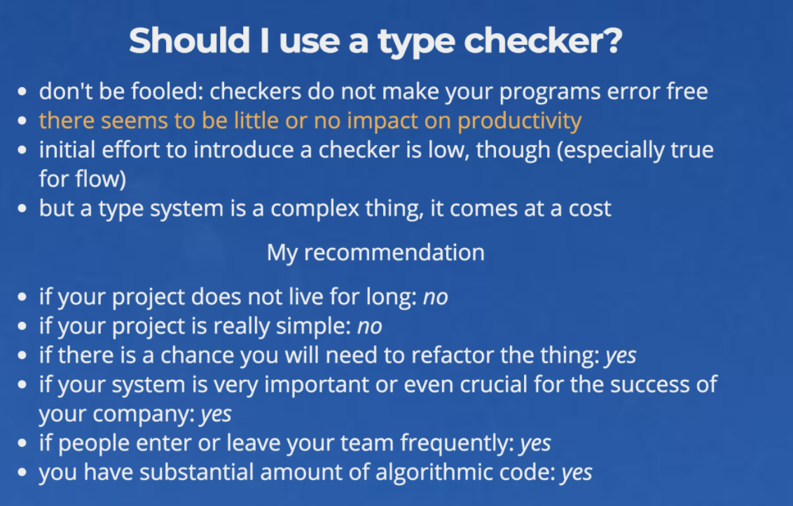


flow： 一个 JAVASCRIPT 静态类型检测器
TypeScript: 是Javascript类型的超集，它可以编译成纯JavaScript


最近看vue源码发现一些不认识的语法，查了一下才发现是flow，很不好意思的说最近才去了解了ts和flow。正好有时间整理成这篇博客
## 了解TypeScript和flow
这是它们官网给出的定义
### flow
来自facebook
- 类型接口 : Flow 使用类型接口查找错误，甚至不需要任何类型声明。 它也能够准确地跟踪变量的类型，就像运行时那样。
- JS 风格 : Flow 专为 JavaScript 程序员设计。 他能够理解常用 JS 方言和极具动态的特性
- 实时反馈 : Flow 能立刻检测代码变化，在开发 JS 时提供快速不断地反馈

本人认为第三点是flow与ts较大区别的地方，同时迁入/迁出本低（'可以一个文件一个文件地迁移，不需要一竿子全弄了'）

### TypeScript
来自微软
- 始于JavaScript，归于JavaScript
- 强大的工具构建 大型应用程序 : 类型允许JavaScript开发者在开发JavaScript应用程序时使用高效的开发工具和常用操作比如静态检查和代码重构。
- 先进的 JavaScript : TypeScript提供最新的和不断发展的JavaScript特性，包括那些来自2015年的ECMAScript和未来的提案中的特性，比如异步功能和Decorators，以帮助建立健壮的组件。

本人觉得第二点说明了ts比较适合的使用场景：大型应用、代码重构。
## TypeScript vs flow
强烈推荐[Flow vs TypeScript](http://djcordhose.github.io/flow-vs-typescript/flow-typescript-2.html#/45)这篇文章，有很详细的对比
vue中使用了flow，flow的适合场景可以参考尤大的回答[Vue 2.0 为什么选用 Flow 进行静态代码检查而不是直接使用 TypeScript？](https://www.zhihu.com/question/46397274)

## 是否使用TypeScript/flow
虽然TypeScript/flow都是基于js的，但他们的类型机制还是需要花费成本学习（类、接口），并非适用任何项目，这是Flow vs TypeScript推荐的参考标准，可以参照下

参考文档：
[Flow vs TypeScript](http://djcordhose.github.io/flow-vs-typescript/flow-typescript-2.html#/)
[TypeScript中文网](https://www.tslang.cn/)
[flow中文翻译文档](https://zhenyong.github.io/flowtype/)
